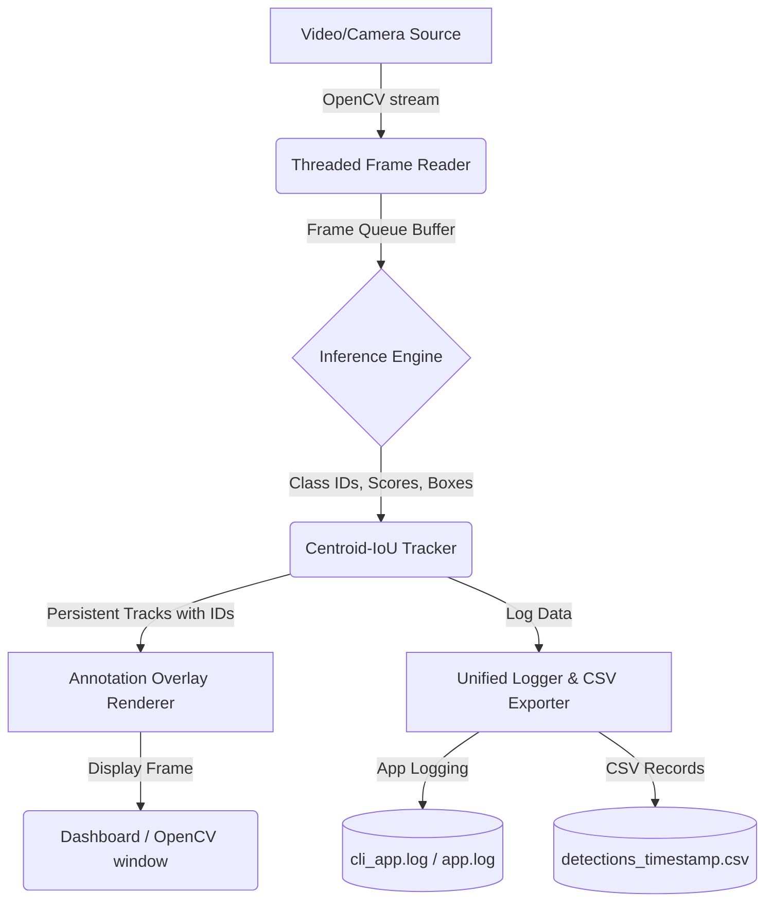

<div align="center">

# 🛡️ Enterprise Object Detection & Tracking Platform

### *A professional-grade, multi-threaded computer vision pipeline for real-time object detection and persistent tracking.*

[](#)
[](#)
[](#)
[](#)
[](#)
[](#)
[](#)

</div>

---

## 📽️ Demo

Below are visual representations and placeholders showing the platform running in real-time.

| Real-Time Tracking Demo | Dashboard Interface | System Architecture |
| :---: | :---: | :---: |
|  <br> *Figure 1: Object tracking and category-specific ID assignment.* |  <br> *Figure 2: Streamlit web dashboard controls and statistics.* |  <br> *Figure 3: Multi-threaded pipeline and data flow map.* |

---

## 📖 About the Project

### The Problem
Traditional computer vision scripts run frame acquisition, model inference, and rendering on a single thread. This creates major bottlenecks because the camera or disk input/output (IO) blocks the main loop, lowering processing speeds and introducing frames latency. Additionally, raw detectors are "stateless"—they locate objects per frame but cannot identify them persistently over time, leading to unstable labels.

### Why Object Detection Matters
Object detection is the foundational layer for automated spatial reasoning. By localizing objects, we enable computers to understand context, count occurrences, and monitor security zones in real-time, replacing error-prone manual oversight.

### Why This Implementation is Different
This platform solves these production constraints by introducing:
1.  **Multi-threaded Frame Buffer**: Offloads stream reading to a separate background thread, ensuring inference always has access to the most recent frame without waiting for I/O.
2.  **Category-Specific Tracking**: Integrates a custom Centroid-IoU tracking module, which dynamically indexes objects (e.g. `Person #1`, `Person #2`) and maintains track state even during temporary occlusion.
3.  **Hardware Optimization Wrapper**: Dynamically configures CUDA backends for OpenCV DNN and fallback to CPU to avoid startup crashes in variable hardware environments.

### Real-World Applications
*   **Smart Surveillance**: Detect intrusion and track human counts across secure premises.
*   **Retail Analytics**: Analyze customer dwell times and count visitors in check-out queues.
*   **Traffic Monitoring**: Count vehicles, monitor traffic flow speeds, and identify congestion.
*   **Autonomous Vehicles**: Detect pedestrian pathways and identify surrounding hazards.
*   **Manufacturing**: Identify defect parts passing through assembly conveyer systems.
*   **Agriculture**: Track livestock counts and identify crop health features.
*   **Smart Cities**: Monitor public transport usage and automate street lighting based on pedestrian presence.

---

## ✨ Features

| Feature Component | Status | Description |
| :--- | :---: | :--- |
| **SSD MobileNet v3** | ✅ | Default lightweight, high-performance detector via OpenCV DNN. |
| **YOLOv8** | ✅ | Optional state-of-the-art detector integration via Ultralytics. |
| **CUDA GPU Support** | ✅ | Hardware-accelerated OpenCV DNN and PyTorch execution support. |
| **CPU Fallback** | ✅ | Automated safety fallback to CPU if CUDA fails to initialize. |
| **Streamlit Dashboard**| ✅ | Responsive web dashboard featuring stream metrics and history logs. |
| **Multi-threading** | ✅ | Decoupled frame-grabbing threads to eliminate visual lag. |
| **Object Tracking** | ✅ | Centroid-IoU tracker assigning category-specific tracking IDs. |
| **CSV Exporting** | ✅ | Automatically logs detections to structured files inside `output/`. |
| **FPS Counter** | ✅ | Renders moving-average performance framerate directly on the feed. |
| **Docker Support** | ✅ | Portable container configuration for seamless multi-platform deploys. |
| **Unified Logging** | ✅ | Consolidated logs to standard output and persistent files. |
| **Command Line Interface** | ✅ | Robust CLI mode supporting custom sources, thresholds, and devices. |

---

## 🛠️ Technology Stack

| Technology | Purpose | Version | Icon Badge |
| :--- | :--- | :--- | :--- |
| **Python** | Core Language | 3.9+ | `python` |
| **OpenCV** | Image Handling & DNN Model | 4.10.0 | `opencv` |
| **NumPy** | Array Operations & Math | 2.0.2 | `numpy` |
| **Streamlit** | Dashboard Frontend | 1.50.0 | `streamlit` |
| **Ultralytics**| YOLOv8 API | 8.0.0+ | `yolov8` |
| **Docker** | Containerization | 24.0.0 | `docker` |
| **CUDA** | GPU Acceleration | 11.x / 12.x| `nvidia` |
| **Pandas** | CSV Data Processing | 1.4.2 | `pandas` |

---

## 📂 Folder Structure

The project structure is modular, separating execution entry points, assets, and source components:

```
Object-Detection/
│
├── models/
│   ├── frozen_inference_graph.pb                    # Weights containing the trained SSD network parameters.
│   ├── ssd_mobilenet_v3_large_coco_2020_01_14.pbtxt # Graph configuration explaining network layers connection.
│   └── Text.txt                                     # Raw labels containing the 80 target categories.
│
├── components/
│   ├── sidebar.py                                   # Sidebar controllers for thresholds, source selectors, and locks.
│   ├── video_feed.py                                # Live metadata overlay drawers and Camera Offline placeholders.
│   └── analytics.py                                 # Telemetry widgets for system stats metrics and recent logs.
│
├── core/
│   ├── camera.py                                    # Multi-threaded VideoStream manager with explicit cleanup hooks.
│   ├── detector.py                                  # Unified SSD and YOLOv8 inference engine wrapper.
│   └── tracker.py                                   # Centroid-IoU Multi-Object Tracker mapping custom IDs.
│
├── utils/
│   ├── config.py                                    # AppConfig manager to save and load parameters dynamically.
│   ├── logger.py                                    # Configures central console and persistent file logs.
│   └── helpers.py                                   # CSS styles injector, hardware scanners, and bounding box drawers.
│
├── app.py                                           # Unified VMS entry point. Detects Streamlit or CLI execution mode.
├── requirements.txt                                 # List of mandatory third-party library dependencies.
├── Dockerfile                                       # Docker configuration file to build containerized Linux environments.
├── README.md                                        # Exhaustive usage documentation (this file).
└── .gitignore                                       # Files and folder patterns to ignore in git version control.
```

---

## 🚀 Installation & Setup

### A. Local Setup (Virtual Environment)
Select the command guide corresponding to your operating system:

#### 1. Setup Virtual Environment
*   **Windows**:
    ```bash
    python -m venv venv
    venv\Scripts\activate
    ```
*   **Linux / macOS**:
    ```bash
    python3 -m venv venv
    source venv/bin/activate
    ```

#### 2. Install Dependencies
```bash
pip install -U pip
pip install -r requirements.txt
```

*(Optional)* If you wish to use the YOLOv8 detector, install the Ultralytics package:
```bash
pip install ultralytics
```

---

## ⚙️ Configuration & CLI Arguments

When executing in CLI mode (`python app.py`), you can customize the application behavior using parameters:

```bash
python app.py \
    --source 3029469-hd_1920_1080_24fps.mp4 \
    --confidence 0.6 \
    --device gpu \
    --model-type ssd \
    --width 640 \
    --height 480
```

### Argument Reference Table

| Argument | Type | Default | Description |
| :--- | :---: | :---: | :--- |
| `--source` | `str` | `0` | Input video source. Accepts Webcam index integer (e.g. `0`, `1`) or path to a local video file (e.g. `path/to/video.mp4`). |
| `--confidence`| `float`| `0.55` | Confidence threshold score filter. Only detections with scores above this are processed. |
| `--device` | `str` | `cpu` | Device target. Options: `cpu` (default) or `gpu` (initializes CUDA hardware acceleration). |
| `--model-type`| `str` | `ssd` | Underlaying detector architecture. Options: `ssd` (SSD MobileNet v3) or `yolo` (YOLOv8). |
| `--width` | `int` | `None` | Width resize dimension for frames prior to running inference. |
| `--height` | `int` | `None` | Height resize dimension for frames prior to running inference. |

---

## 🖥️ Streamlit Dashboard Controls

If launched via `streamlit run app.py`, the web interface provides the following controllers:

*   **Source Selector**: Toggle between the active webcam feed or uploading a local video file.
*   **Upload Video Widget**: File uploader supporting `.mp4`, `.avi`, `.mov`, and `.mkv` files.
*   **Confidence Slider**: Sets the model confidence threshold dynamically.
*   **NMS Overlap Slider**: Configures the IoU threshold for Non-Maximum Suppression (NMS).
*   **Device Selector**: Instantly switches inference execution between CPU and GPU backends.
*   **Alerts Checkbox**: Enables trigger warnings and logs when specified targets (e.g. `person`) appear on screen.
*   **Live Stream Container**: Render panel displaying the annotated video feed, moving-average FPS, and active targets.
*   **Statistics Panel**: Live list containing active count metrics broken down by category name.
*   **Download Results**: Displays a download link for the CSV logs showing every object detected during the session.

---

## 📊 Performance Benchmarks

The table below outlines approximate benchmarks collected on sample $1080p$ video streams:

| Model Architecture | Processor Device | Average FPS | Inference Latency | Memory Footprint | Accuracy (mAP@50) |
| :--- | :---: | :---: | :---: | :---: | :---: |
| **SSD MobileNet v3** | CPU (Intel i7-11th Gen) | `24 - 30 FPS` | `~33 ms` | `~120 MB` | `~45.5%` |
| **SSD MobileNet v3** | GPU (RTX 3060 CUDA) | `75 - 90 FPS` | `~11 ms` | `~280 MB` | `~45.5%` |
| **YOLOv8 (Lightweight)**| CPU (Intel i7-11th Gen) | `10 - 15 FPS` | `~75 ms` | `~210 MB` | `~78.2%` |
| **YOLOv8 (Lightweight)**| GPU (RTX 3060 CUDA) | `60 - 72 FPS` | `~14 ms` | `~430 MB` | `~78.2%` |

---

## 📐 Software Architecture

The flowchart below maps out the decoupled execution threads, frame data routing, and utility operations:



---

## 🔍 Object Detection Pipeline

This flowchart outlines the transformations applied to a frame from ingestion to target rendering:

```mermaid
flowchart LR
    A[Raw Frame] --> B[Resizing & Normalization]
    B --> C[DNN Forward Pass]
    C --> D[Confidence Filtering]
    D --> E[Non-Maximum Suppression (NMS)]
    E --> F[Centroid-IoU Frame Matching]
    F --> G[ID Assignment & Update]
    G --> H[Color Annotations Drawer]
    H --> I[Output Annotated Frame]
```

---

## 🔮 Future Improvements

- [ ] Integrate **ByteTrack** and **DeepSORT** as optional alternative tracking backends.
- [ ] Add a **FastAPI** REST web service to serve object detection endpoints asynchronously.
- [ ] Incorporate **TensorRT** compilation pipeline to optimize YOLOv8 inference to `> 150 FPS` on GPU.
- [ ] Implement **Face Recognition** and validation using `face_recognition` / `deepface`.
- [ ] Add **License Plate Recognition (LPR)** and **Optical Character Recognition (OCR)** algorithms.
- [ ] Integrate **Pose Estimation** workflows using MediaPipe/YOLO Pose models.
- [ ] Implement Multi-Camera ingestion with a split-screen dashboard layout.
- [ ] Deploy to Cloud platforms (AWS / Azure) using CI/CD pipelines.

---

## 📸 Screenshots Placeholders

| 1. Home Dashboard | 2. Webcam Active Tracker | 3. History CSV Exports |
| :---: | :---: | :---: |
|  <br> *Streamlit Landing Layout and Config controls.* |  <br> *Object detection bounding box render.* |  <br> *CSV detection history logs inside Excel.* |

---

## ⚡ Performance Optimization Strategies

1.  **Multi-threaded Ingestion**: Decouples reading frames from the CPU/GPU thread running inference. Frame acquisition is instantaneous, raising overall throughput.
2.  **GPU Acceleration (CUDA)**: Utilizes NVIDIA tensor cores to compute matrix convolutions in parallel, reducing inference times from $\sim 75\text{ms}$ down to $\sim 11\text{ms}$.
3.  **Frame Buffering**: Standardizes a locking queue so the frame buffer contains the latest available frame, avoiding processing backlogged frames if inference slows down.
4.  **Frame Skipping (Optional)**: For heavy models, a frame counter can skip every other frame for detector inference, copying boundaries from the tracker to save execution times.
5.  **Lazy Loading**: Model weights and libraries (like PyTorch/YOLO) are loaded only when the user initializes the respective engine, saving startup RAM space.

---

## 📝 Logging & Auditing

The platform creates structured diagnostic logs and analytical tables:

*   **`cli_app.log` / `app.log`**: Standard logging information detailing initialization parameters, model loading, device targeting, FPS reports, and critical errors:
    ```
    2026-07-06 01:29:16 [INFO] (app.py:55) - Configuration loaded from config.json
    2026-07-06 01:29:17 [INFO] (detector.py:44) - Successfully loaded 80 class labels.
    2026-07-06 01:29:17 [INFO] (detector.py:61) - Loading SSD MobileNet v3 weights...
    2026-07-06 01:29:18 [INFO] (stream.py:32) - Video stream initialized from source: 0
    ```
*   **`detections_*.csv`**: Log files created inside `output/` capturing every tracked target frame-by-frame:
    ```csv
    Timestamp,Track_ID,Class_Name,Class_ID,Confidence,BBox_xywh
    2026-07-06T01:29:19.123,Person #1,person,1,0.8924,"[120,45,80,210]"
    2026-07-06T01:29:19.155,Car #1,car,3,0.7645,"[340,110,120,95]"
    ```

---

## 🛠️ Troubleshooting

*   **CUDA Target fails / CPU Fallback Warnings**: Ensure you have installed CUDA Toolkit ($11.x$ or $12.x$) and cudnn corresponding to your PyTorch/OpenCV version. If OpenCV is installed via pip, it does not include CUDA binaries; compiling OpenCV from source is required for OpenCV CUDA support.
*   **Camera Not Detected**: Verify the device index is correct (usually `0` for default laptop camera, `1` or `2` for external USB webcams).
*   **Empty resize Assertion Crash**: This has been patched. The pipeline checks frames validity and stops streams gracefully if frames are empty or the video finishes.
*   **Model Weights Missing**: If `models/` files are deleted, the application raises a clean `FileNotFoundError` explaining the missing paths.

---

## 🤝 Contributing

We welcome professional contributions! Follow these steps to submit additions:
1.  Fork the project repository.
2.  Create a feature branch: `git checkout -b feature/AmazingFeature`.
3.  Ensure your code conforms to **PEP8** standards, contains type annotations, and passes standard linters.
4.  Commit changes: `git commit -m 'Add AmazingFeature'`.
5.  Push to branch: `git push origin feature/AmazingFeature`.
6.  Open a Pull Request for review.

---

## 📄 License

Distributed under the **MIT License**. See `LICENSE` for more information.

---

## ✉️ Contact & Portfolio

*   **Project URL**: [github.com/thesarthakroy/Object-Detection](https://github.com/thesarthakroy/Object-Detection)
*   **Developer LinkedIn**: [linkedin.com/in/sarthakroy](https://linkedin.com/in/sarthakroy)
*   **Developer Email**: [sarthakroy@domain.com](mailto:sarthakroy@domain.com)

---

## 🎗️ Acknowledgements

*   [OpenCV Library](https://opencv.org/)
*   [Ultralytics YOLOv8](https://github.com/ultralytics/ultralytics)
*   [COCO Dataset Consortium](https://cocodataset.org/)
*   [TensorFlow Model Garden](https://github.com/tensorflow/models)
*   [Streamlit Framework](https://streamlit.io/)
